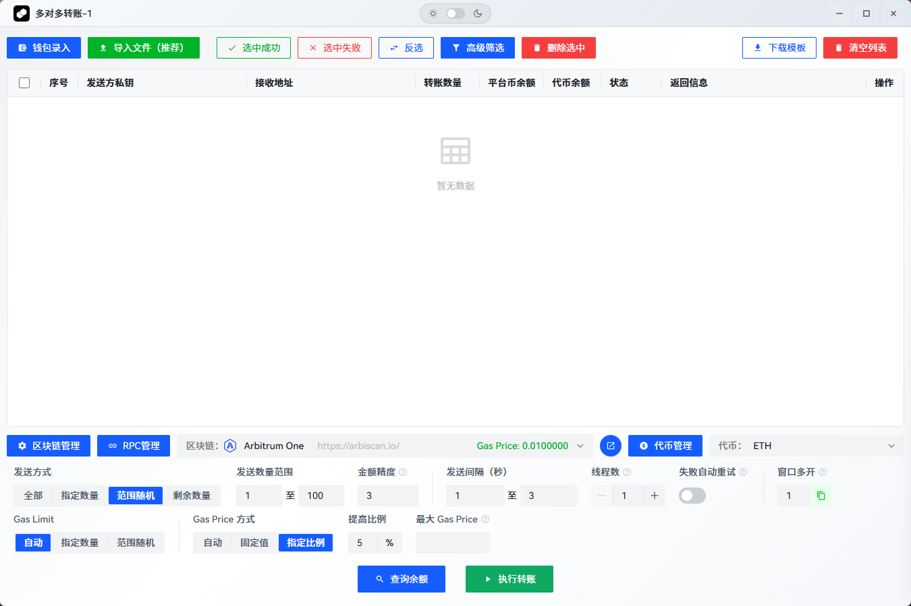

# Wallets Tool
[](https://github.com/WalletsTool/WalletsTool/releases)
[](https://github.com/WalletsTool/WalletsTool/actions/workflows/release.yml)
  
<p align="center">
  <a href="https://github.com/WalletsTool/WalletsTool/releases">快速开始 | Download</a>
</p>

> [!WARNING]
> 本项目仅供区块链工作室交流学习使用。使用本工具需自行承担风险，请确保在使用前充分了解相关区块链网络的规则和风险，谨慎操作您的数字资产。

<div align="center"  style="margin-bottom: 20px;">
    
</div>

Web3 多链钱包管理工具（Vue 3 + Tauri/Rust），支持 Ethereum/Solana，批量导入、余额批量查询、批量转账、RPC/代币配置、Excel 导入导出，SQLite 本地存储（私钥不落盘）。

Web3 multi-chain wallet manager (Vue 3 + Tauri/Rust). Supports Ethereum & Solana, batch import/transfer/balance check, RPC/Token config, Excel I/O, local SQLite with no private key persistence.

## 🏆 为什么选择本地桌面应用？

### 🔒 **极致安全性**
| 本地桌面应用 | 浏览器在线工具 |
|-------------|---------------|
| ✅ **私钥永不离开设备** - 所有敏感数据仅在本地内存中处理，不做任何传输和存储 | ❌ 私钥可能通过网络传输，存在泄露风险 |
| ✅ **无第三方依赖** - 完全离线运行，不依赖外部服务 | ❌ 依赖第三方服务器，存在服务商风险 |
| ✅ **代码开源透明** - 完全开源，可审计安全性 | ❌ 后端代码不透明，无法验证安全性 |
| ✅ **永久可用** - 一次安装，永久使用 | ❌ 服务商可能随时停止服务 |
| ✅ **数据完全自主** - 所有数据存储在本地，完全掌控 | ❌ 数据依赖云端服务，可能面临服务中断 |
| ✅ **无审查风险** - 不受网络封锁或服务商限制影响 | ❌ 可能面临服务商封禁或地区限制 |

### ⚡ **卓越性能**
| 本地桌面应用 | 浏览器在线工具 |
|-------------|---------------|
| ✅ **原生性能** - Rust + Tauri 提供接近原生的执行效率 | ❌ 受浏览器性能限制，执行效率较低 |
| ✅ **批量操作优化** - 多线程并发处理，速度更快 | ❌ 受浏览器并发限制，批量操作缓慢 |
| ✅ **内存管理优化** - 精确的内存控制，避免内存泄露 | ❌ 受浏览器内存管理限制 |
| ✅ **无网络延迟** - 本地计算，响应即时 | ❌ 依赖网络请求，存在延迟和超时风险 |

### 🎯 **专业功能**
| 本地桌面应用 | 浏览器在线工具 |
|-------------|---------------|
| ✅ **系统级集成** - 深度集成操作系统，提供更好体验 | ❌ 受浏览器沙盒限制，功能受限 |
| ✅ **文件系统访问** - 直接读写本地文件，支持 Excel 导入导出 | ❌ 文件操作受限，用户体验较差 |
| ✅ **多窗口支持** - 支持同时打开多个功能窗口 | ❌ 受浏览器标签页限制 |
| ✅ **系统通知** - 原生系统通知，及时提醒交易状态 | ❌ 通知功能受限且不稳定 |

### 💡 **用户体验优势**
- **🚀 一键启动** - 使用 `yarn start` 命令自动安装依赖并启动开发环境
- **🔧 零配置** - 自动检测和安装所需依赖（Node.js、Yarn、Rust、Cargo）
- **📱 原生界面** - 完全原生的桌面应用体验，不是网页套壳
- **🎨 自定义主题** - 支持深度定制界面主题和布局
- **⌨️ 快捷键支持** - 完整的键盘快捷键支持，提高操作效率

## ✨ 功能特性

### 🔗 多链支持

* **Ethereum** - 以太坊主网及测试网

* **Solana** - Solana 主网及测试网（进行中）

* **自定义链** - 支持添加自定义区块链网络

* **链配置管理** - RPC 节点管理、代币配置

### 💰 钱包管理

* **批量导入** - 支持私钥文本粘贴和 Excel 文件导入

* **多对多转账** - 支持批量转账操作，模拟正常用户行为

* **余额查询** - 多链余额实时查询，支持原生代币和 ERC-20 代币

* **数据导出** - 支持查询结果导出为 Excel 报表

### ⚡ 高级功能

* **智能 Gas 管理** - 自动 Gas 估算和优化

* **交易监控** - 实时交易状态跟踪

* **失败重试** - 智能重试机制，避免重复转账

* **多窗口支持** - 支持同时打开多个功能窗口

### 🛡️ 安全特性

* **本地存储** - 所有数据本地 SQLite 数据库存储（数据库仅保存链信息、币信息和rpc信息，钱包私钥仅在内存中处理，不会存储在数据库中）


* **私钥保护** - 私钥仅在内存中处理，不做任何存储

* **交易验证** - 完整的交易验证和确认机制

## 🏗️ 技术架构

### 前端技术栈

* **Vue 3** - 现代化前端框架

* **Vite** - 快速构建工具

* **PrimeVue** - UI 组件库

* **Arco Design** - 补充 UI 组件

* **ethers.js** - 以太坊交互库

* **party-js** - 动画效果库

* **xlsx** - Excel 文件处理

### 后端技术栈

* **Tauri** - 跨平台桌面应用框架 (Rust)

* **SQLite** - 轻量级本地数据库

* **tokio** - 异步运行时

### 项目结构

```
WalletsTool/
├── src/                    # 前端源码
│   ├── components/         # 公共组件
│   ├── features/          # 功能模块
│   │   ├── ethereum/      # 以太坊相关功能
│   │   ├── solana/        # Solana 相关功能
│   │   └── home/          # 主页
│   ├── router/            # 路由配置
│   └── stores/            # 状态管理
├── src-tauri/             # Tauri 后端
│   ├── src/               # Rust 源码
│   ├── data/              # 数据库文件
│   └── icons/             # 应用图标
├── public/                # 静态资源
└── tests/                 # 测试文件
```

## 🚀 快速开始

### 🎯 一键启动（推荐）

```bash
# 自动安装所有依赖并启动开发环境
yarn start
```

> **💡 智能依赖管理**：`yarn start` 命令会自动检测并安装所需的所有依赖项，包括 Node.js、Yarn、Rust 和 Cargo，然后启动开发环境。无需手动配置！

### 📋 环境要求

以下依赖项将通过 `yarn start` 自动安装和配置：

* **Node.js** >= 18.0.0
* **Yarn** 包管理器
* **Rust** >= 1.70.0
* **Tauri CLI** >= 2.0.0

### 🔧 手动安装（可选）

如果您希望手动安装依赖项：

```bash
# 安装前端依赖
yarn install

# 安装 Tauri CLI (如果未安装)
cargo install tauri-cli --version "^2.0.0"
```

### 🚀 开发模式

```bash
# 启动开发服务器
yarn tauri-dev
```

### 📦 构建应用

```bash
# 构建生产版本
yarn tauri-build
```

### 🛠️ 故障排除

如果遇到依赖安装问题：

1. **清理缓存**：
   ```bash
   yarn cache clean
   rm -rf node_modules
   yarn install
   ```

2. **重新安装 Rust**：
   ```bash
   rustup update
   cargo install tauri-cli --version "^2.0.0" --force
   ```

3. **检查系统环境**：
   - 确保已安装 Visual Studio Build Tools (Windows)
   - 确保已安装 Xcode Command Line Tools (macOS)
   - 确保已安装 build-essential (Linux)

4. **使用依赖安装脚本**：
   ```bash
   node scripts/install-deps.js
   ```

## 📖 使用指南
<div align="center">
  <br/>
    <span>主页截图</span>
  <br/>
    <br/>
    
    <br/>
      <br/>
    <span>批量转账页面截图</span>
    <br/>
      <br/>
    
</div>

### 1. 链配置管理

1. 打开应用后，点击「链管理」按钮
2. 添加或编辑区块链网络配置
3. 配置 RPC 节点和代币信息

### 2. 批量转账

1. 选择目标区块链网络
2. 导入发送方私钥和接收方地址
3. 配置转账参数（数量、Gas 设置等）
4. 开始执行批量转账

### 3. 余额查询

1. 导入要查询的钱包地址
2. 选择要查询的代币类型
3. 可选：开启“查询最后交易时间”开关以同时查询最后交易时间（默认关闭）
4. 执行批量余额查询

#### 配置参数：查询最后交易时间

- `queryLastTransactionTime`（前端组件 props / 表单项）
  - 类型：`boolean`
  - 默认值：`false`
  - 作用：开启后端对每个地址的“最后交易时间”查询；关闭时跳过该步骤，提高查询速度。
- 传参与行为：
  - 前端会在查询参数中传递 `query_last_transaction_time` 字段到后端。
  - 后端按该布尔值决定是否执行最后交易时间查询。

示例（在 Balance 页面中使用）：

```vue
<Balance :queryLastTransactionTime="false" />
```

在页面右上方的配置区域也提供了开关项“查询最后交易时间”，用于动态控制此行为。
4. 导出查询结果为 Excel 文件

## 🔧 开发指南

### 添加新的区块链支持

1. 在 `src/features/` 下创建新的链目录
2. 实现转账和余额查询功能
3. 在数据库中添加链配置
4. 更新路由配置

### 自定义组件开发

```vue
<template>
  <div class="custom-component">
    <!-- 组件内容 -->
  </div>
</template>

<script setup>
// 组件逻辑
</script>
```

### 数据库操作

```rust
// 在 Rust 后端中操作数据库
use crate::database::chain_service::ChainService;

#[tauri::command]
async fn get_chains() -> Result<Vec<Chain>, String> {
    // 数据库操作逻辑
}
```

## 🗂️ 数据库结构

### 主要数据表

* **chains** - 区块链网络配置

* **rpc\_providers** - RPC 节点配置

* **tokens** - 代币配置信息

* **monitor\_configs** - 监控配置（未来功能）

* **monitor\_history** - 监控历史（未来功能）

## 🛣️ 开发路线图

### 已完成功能 ✅

* [x] 基础钱包管理

* [x] 多链余额查询

* [x] 批量转账功能

* [x] 链配置管理

* [x] 数据导入导出

### 开发中功能 🚧

* [ ] 极速分发功能

* [ ] 链上地址监控

* [ ] 私钥加密存储

* [ ] 多线程转账优化

### 计划功能 📋

* [ ] CEX 工具集成 (Binance, OKX, Bybit)

* [ ] DEX 工具集成 (Uniswap, SushiSwap)

* [ ] 合约监控功能

* [ ] 自动抢购机制

* [ ] 消息通知系统

## 🤝 贡献指南

1. Fork 本仓库
2. 创建功能分支 (`git checkout -b feature/AmazingFeature`)
3. 提交更改 (`git commit -m 'Add some AmazingFeature'`)
4. 推送到分支 (`git push origin feature/AmazingFeature`)
5. 打开 Pull Request

## 📄 许可证

Copyright © 2025 EzBan. All rights reserved.

## 🔗 相关链接

* [Tauri 官方文档](https://tauri.app/)

* [Vue 3 官方文档](https://vuejs.org/)

* [PrimeVue 组件库](https://primevue.org/)

* [ethers.js 文档](https://docs.ethers.org/)

## ⚠️ 免责声明

本工具仅供学习和研究使用，使用者需要自行承担使用风险。请确保在使用前充分了解相关区块链网络的规则和风险，谨慎操作您的数字资产。

***

如有问题或建议，欢迎提交 Issue 或联系开发团队。
